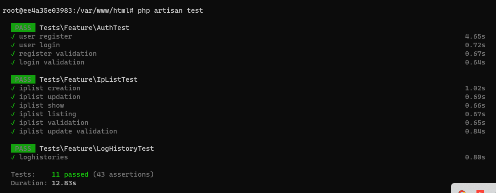
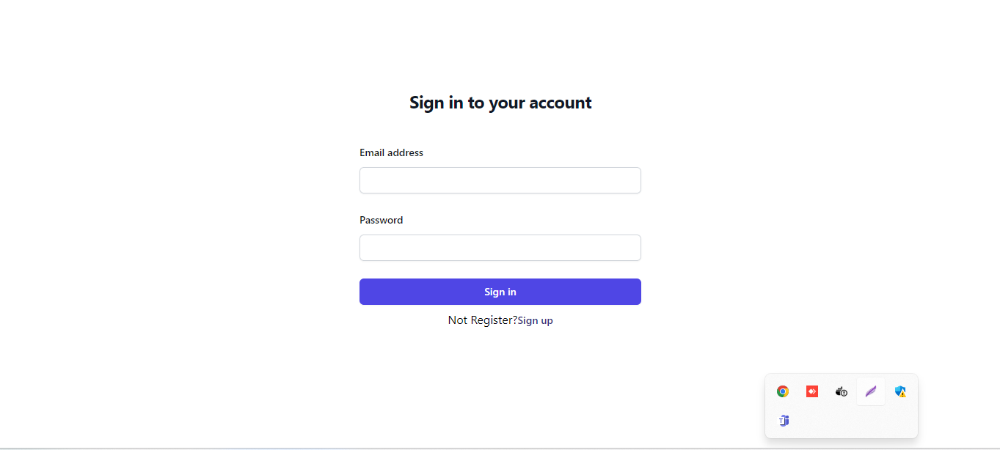
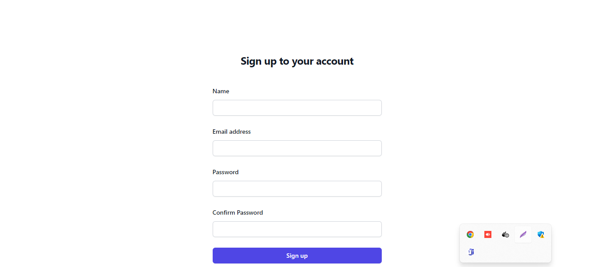
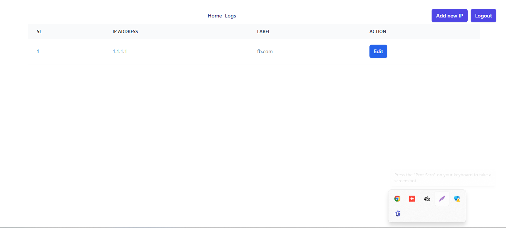
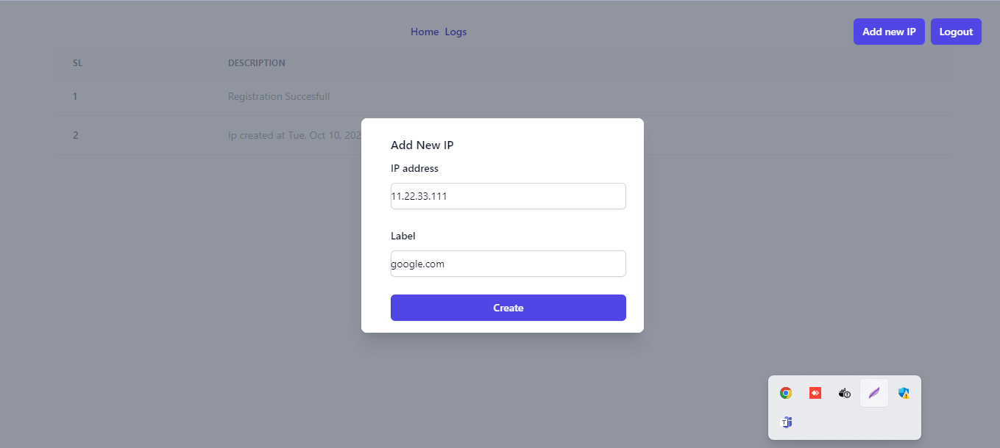
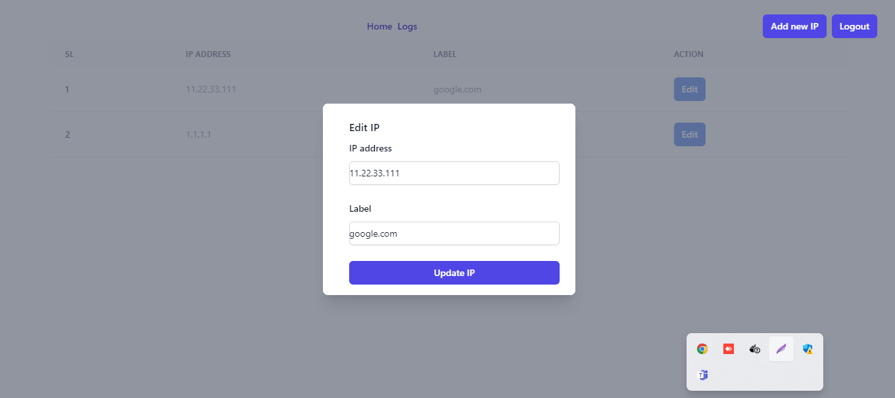
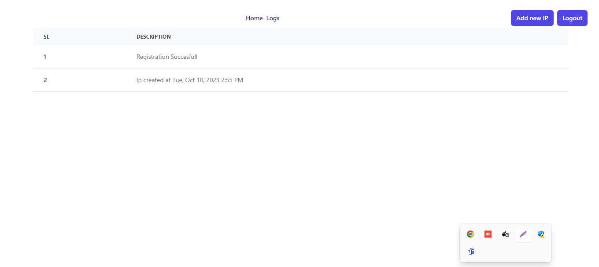

# IpManagement(react, nginx, php, Laravel,mysql,phpmyadmin,docker)
## Prerequisites

- Docker 
- Node.js

## Getting Started
### Project Setup
1. Clone the repository
`git clone https://github.com/enam-0042/IpManagement.git`

2. Navigate to the project directory
`cd ipmanagement`

3. Copy `.env.example` file and rename it to `.env`

4. Run   `docker-compose up -d`

### Backend Settings 
1. Navigate to backend directory
 `cd backend`

2. Copy `.env.example` file and rename it to `.env`

3. Open Php Container
`docker-compose exec -it php bash `

4. Install php dependencies
 `composer install`

5. Generating application key
`php artisan key:generate`

6. Generate Migration
`php artisan migrate`

### Phpmyadmin 
1. To access phpmyadmin service
`http://localhost:8085/`

### Unit Test
1. Open php container
`docker-compose exec -it php bash `

2. To run unit testing 
`php artisan test`

3. Demo

### Frontend Settings 
1. Navigate to frontend directory  `cd frontend`

2. Install dependencies
`npm install `

3. Start application `npm run dev`

4. It will run at `http://localhost:5173/`

## Project Demo
1. Signin Page

2. Registration Page

3. Home Page

4. Add IP 

5. Update IP 

6. Log

